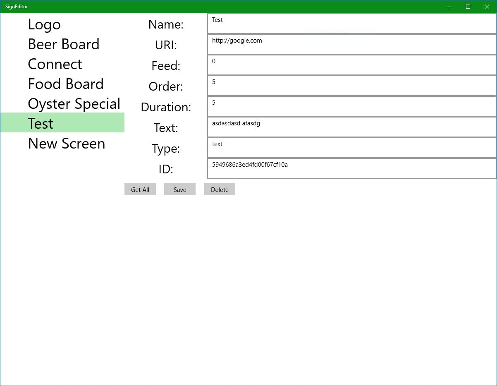

# CarniDigiSign_App

# History
Previously, this was part of a three piece solution: an app to [display screens](https://github.com/graboskyc/CarniDigiSign_IOT) on Windows10IOT, this app app to [create signs](https://github.com/graboskyc/CarniDigiSign_App), and a third app which [acts as the server](https://github.com/graboskyc/CarniDigiSign_Server).

Now this has been simplified as the server solution is legacy in favor of using MongoDB Atlas as the cloud database and MongoDB Stitch as the serverless platform for REST APIs.

# About this repo

So now this app will allow for creating signs in rotation and the other project still display screens](https://github.com/graboskyc/CarniDigiSign_IOT).

The end result is a simple to deploy and manage utility for digital signage. 

# Sign type support

Supported options for the type of screen are:
* Hidden - _hide_ - The record is ignored but kept in the database
* Image - _image_ - A URL to an image
* Text - _text_ - The Text field is displayed in line
* Tweet - _tweet_ - The URL to a specific tweet. The Twitter API is called to retrieve and it is formatted
* Video - _video_ - A URL to a video file supported by the UWP video element
* Web - _web_ - A URL to a website
